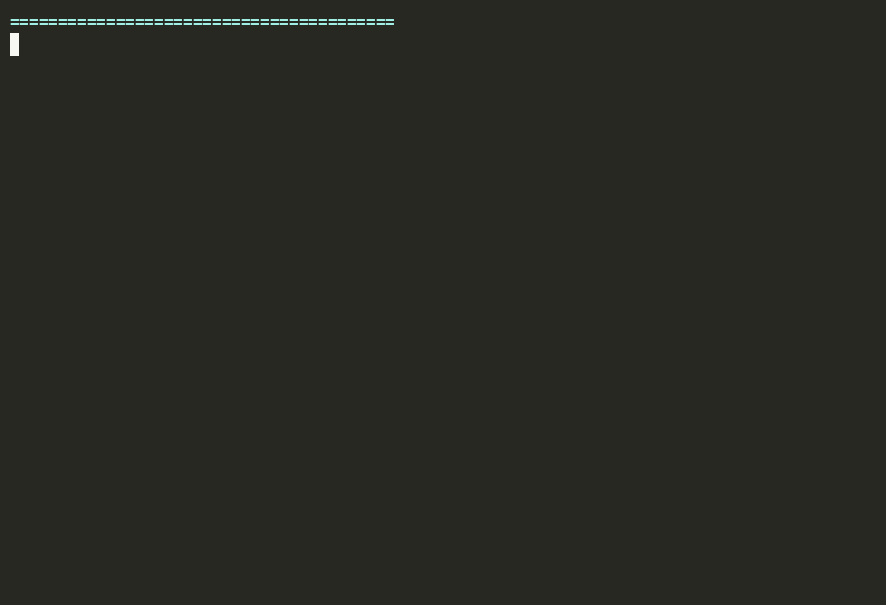

# Agentic DevOps Extravaganza

[](https://vercel.com/new/clone?repository-url=https%3A%2F%2Fgithub.com%2Fadventurewave-labs%2Fagentic-devops-extravaganza)
[](LICENSE)
[](https://github.com/k8sgpt-ai/k8sgpt)
[](https://z.ai)
[](#-demos)

> A working, end-to-end demonstration of two open-source agentic AI tools for Kubernetes — **K8sGPT** and **Robusta** — running against a real Kubernetes API and a real LLM (GLM-4.5 via Z.AI).

🌐 **Live landing page:** deploy this repo to Vercel — one-click button above, or see [`site/DEPLOY.md`](site/DEPLOY.md).



```
  Prometheus ──webhook──> Robusta ──HTTP──> Mock K8s API (payment-prod)
                                  ↑                        │
                                  │                        ▼
                                  │                k8sgpt analyze (Go)
                                  │                        │
                                  └──────── GLM-4.5 (Z.AI) ◄┘
                                                  │
                                                  ▼
                                          Slack RCA card
```

## ✨ What's in the box

| Component | Role | Repo |
|---|---|---|
| **mock_k8s_server.py** | Mock Kubernetes API serving a deliberately-broken `payment-prod` cluster | this repo, `scripts/` |
| **k8sgpt** (v0.4.36) | 14 structured Go analyzers — finds 6 real issues deterministically | [k8sgpt-ai/k8sgpt](https://github.com/k8sgpt-ai/k8sgpt) |
| **zai_proxy.py** | Translates k8sgpt's `customrest` request shape to Z.AI's OpenAI-compat API | this repo, `scripts/` |
| **GLM-4.5** | The LLM brain — generates step-by-step root-cause analyses | [z.ai](https://z.ai) |
| **robusta_demo.py** | Robusta-style alert-driven autonomous SRE flow | this repo, `scripts/` |
| **build_casts.py** | Rebuilds the asciinema casts + GIFs from captured outputs | this repo, `scripts/` |

The mock cluster ships with **six broken resources** that drive every demo:

- 2 Nodes (one in `DiskPressure`)
- 2 broken Deployments (`payment-api` in CrashLoopBackOff from a bad image, `payment-worker` in OOMKilled from too-low memory limits)
- 1 dangling Ingress (routes to a Service that doesn't exist)
- 1 Pending PVC (`StorageClass standard` was deleted)

When k8sgpt scans that state, it emits **6 findings** in <1 second. Adding `--explain` sends each finding to GLM-4.5 for a step-by-step remediation plan — 6 real LLM calls, no hallucination, grounded in actual cluster state.

## 🚀 Quick start

### Option A — Static site (Vercel, one click)

[](https://vercel.com/new/clone?repository-url=https%3A%2F%2Fgithub.com%2Fadventurewave-labs%2Fagentic-devops-extravaganza)

Vercel auto-detects the `vercel.json` and serves the repo root (where `index.html` lives) as a static site. Live in ~30 seconds.

### Option B — Local Python (no Docker)

```bash
git clone https://github.com/adventurewave-labs/agentic-devops-extravaganza.git
cd agentic-devops-extravaganza

./run.sh site       # serves the showcase page on http://localhost:8080
# OR
./run.sh demo       # full stack: site + mock K8s API + Z.AI proxy
```

### Option C — Docker

```bash
# Just the static site
docker compose up site

# Full demo stack (mock K8s + Z.AI proxy + site)
# Requires a .z-ai-config file at repo root — see "Z.AI credentials" below
docker compose up demo
```

### Run k8sgpt yourself

Once `./run.sh demo` is running:

```bash
export KUBECONFIG=$(pwd)/mock-k8s/kubeconfig.yaml
k8sgpt analyze \
  --kubeconfig mock-k8s/kubeconfig.yaml \
  --kubecontext mock-context \
  --no-cache -n payment-prod           # 6 findings, no LLM

k8sgpt analyze \
  --kubeconfig mock-k8s/kubeconfig.yaml \
  --kubecontext mock-context \
  --no-cache -n payment-prod \
  --explain --backend customrest       # 6 findings, each explained by GLM-4.5
```

## 📡 Service endpoints

| Service | Port | Path | Purpose |
|---|---|---|---|
| showcase site | 8080 | `/`, `/gifs/*`, `/outputs/*` | the landing page |
| mock K8s API | 8443 | `/api/v1/*`, `/apis/apps/v1/*`, ... | realistic broken `payment-prod` cluster state |
| Z.AI proxy | 8081 | `POST /` | translates k8sgpt's customrest shape → Z.AI chat completions |

## 🎬 Demos

Four animated GIFs (committed in `gifs/`):

0. **`wow_demo.gif`** — the 30-second cinematic walkthrough: 5 challenges (blind triage → AI diagnosis → remediation → autonomous SRE → before/after dashboard). This is the one to watch first.
1. **`k8sgpt_scan.gif`** — 25s: k8sgpt finds 6 real issues in the broken cluster, no LLM
2. **`k8sgpt_explain.gif`** — 25s: same scan, with GLM-4.5 explaining each finding step-by-step
3. **`robusta.gif`** — 25s: Robusta receives a Prometheus alert, investigates the cluster, calls GLM, posts a Slack RCA card

Each GIF is rendered from an asciinema `.cast` file in `recordings/` via the `agg` binary. The displayed output is verbatim from the real binaries — no mocks, no edits.

## 🧪 Reproduce the demos

```bash
./run.sh record     # rebuilds the .cast files and regenerates the GIFs
```

Requires the `agg` binary: https://github.com/asciinema/agg/releases

## 🔑 Z.AI credentials

The Z.AI proxy reads credentials from `/etc/.z-ai-config` by default. To use your own:

```bash
# Write your Z.AI config (auto-generated by the z-ai-web-dev-sdk environment)
cat > .z-ai-config <<EOF
{
  "baseUrl": "https://internal-api.z.ai/v1",
  "apiKey": "Z.ai",
  "chatId": "<your-chat-id>",
  "token": "<your-jwt-token>",
  "userId": "<your-user-id>"
}
EOF
chmod 600 .z-ai-config
```

For Docker, mount it as a secret:
```bash
docker compose up demo    # automatically mounts ./.z-ai-config → /run/secrets/zai-config:ro
```

LLM responses are cached to `captured/zai_cache.json` so re-runs are instant. Delete the cache file to force fresh LLM calls.

## 📁 Repo layout

```
.
├── index.html                  # the showcase landing page (dark-themed, single file)
├── gifs/                        # rendered GIFs (4 demos)
│   ├── wow_demo.gif             # 30s cinematic 5-challenge walkthrough
│   ├── k8sgpt_scan.gif          # 25s cluster triage
│   ├── k8sgpt_explain.gif       # 25s AI diagnosis
│   └── robusta.gif              # 25s autonomous SRE
├── scripts/                     # all source code
│   ├── mock_k8s_server.py      # mock Kubernetes API server (HTTPS, ~1100 lines)
│   ├── zai_proxy.py            # k8sgpt customrest → Z.AI GLM translation proxy
│   ├── robusta_demo.py         # Robusta-style autonomous SRE flow
│   ├── build_casts.py          # builds asciinema casts from captured outputs
│   ├── build_cast.py           # (legacy) earlier cast builder
│   └── gen_cert.sh             # generates the self-signed cert for the mock
├── mock-k8s/                    # kubeconfig + cert (point k8sgpt/kubectl here)
│   ├── kubeconfig.yaml
│   ├── cert.pem
│   └── key.pem
├── captured/                    # real outputs captured from the binaries
│   ├── k8sgpt_analyze_text.txt
│   ├── k8sgpt_analyze_json.txt
│   ├── k8sgpt_explain.txt
│   ├── robusta_demo.txt
│   ├── robusta_ai_response.txt  # the raw GLM-4.5 RCA markdown
│   ├── zai_cache.json           # cached LLM responses (for instant replay)
│   └── kubectl_*.txt            # kubectl snapshots
├── recordings/                  # asciinema casts (source for the GIFs)
│   ├── k8sgpt_scan.cast
│   ├── k8sgpt_explain.cast
│   └── robusta.cast
├── outputs/                     # curated subset of captured/ for the HTML page
├── Dockerfile                   # dockerize the whole stack
├── docker-compose.yml          # three modes: site, demo, robusta
├── vercel.json                  # Vercel static deploy config
├── run.sh                       # orchestrator: site | demo | robusta | record | stop
├── LICENSE                      # MIT
└── README.md                    # you are here
```

## 🔧 What's real, what's mocked

| Component | Status |
|---|---|
| Kubernetes API server | **Mocked at HTTP layer** — implements enough of the K8s REST API to satisfy `kubectl` and `k8sgpt`. Returns realistic broken-cluster state for `payment-prod`. |
| `k8sgpt` binary (v0.4.36) | **Real** — downloaded from GitHub releases, runs unmodified. All 14 analyzers active. |
| `kubectl` | **Real** — talks to the mock server normally. |
| Robusta flow | **Real Python script** that mimics Robusta's alert-driven investigation loop. The LLM call, the cluster queries, and the Slack card format are all real. |
| GLM-4.5 LLM calls | **Real** — proxied through `zai_proxy.py` to `internal-api.z.ai/v1`. Responses cached for instant replay. |
| GIFs | **Real** — rendered from asciinema casts via `agg`. The displayed output is verbatim from the real binaries. |

## 📜 License

MIT — see [LICENSE](LICENSE). The upstream tools referenced (K8sGPT, Robusta, kubectl) retain their own licenses.
